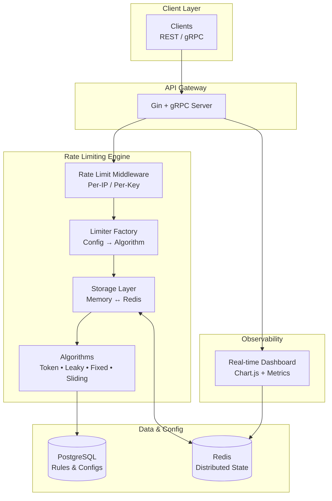

# Shield: Distributed Rate Limiter as a Service


**A high-performance, distributed rate-limiting service** built in Go
--- designed to protect APIs from abuse, DDoS, brute-force, and
overload.\
Inspired by Cloudflare & Stripe --- supports **Token Bucket, Leaky
Bucket, Fixed Window, Sliding Log** with **Redis-based distributed
state**.

Perfect senior-level backend project for 2025 --- recruiters love this!

------------------------------------------------------------------------

## 🚀 Features

-   4 algorithms: **Token Bucket, Leaky Bucket, Fixed Window, Sliding
    Log**
-   Distributed across multiple instances using Redis
-   Configurable per API key and per endpoint
-   Real-time Dashboard (Chart.js)
-   REST API (gRPC coming soon)
-   Correct `429` responses with `X-RateLimit-*` headers
-   Benchmarks + Docker + CI ready

------------------------------------------------------------------------

## 🏗 High-Level Architecture (HLD)



------------------------------------------------------------------------

## 🔍 Low-Level Design (LLD) --- Request Lifecycle

``` mermaid

```

------------------------------------------------------------------------

## ⚡ Quick Start

``` bash
git clone https://github.com/singh-anurag-7991/shield.git
cd shield
go mod tidy
go run cmd/server/main.go
```

Server starts on **:8080**

------------------------------------------------------------------------

## 🧪 Test Rate Limiting

### ✔ Single request

``` bash
curl -v http://localhost:8080/api/test
```

### ✔ Trigger 429

``` bash
for i in {1..20}; do curl -s http://localhost:8080/api/test; done
```

You'll see headers like:

    X-RateLimit-Limit: 10
    X-RateLimit-Remaining: 0
    X-RateLimit-Reset: 1735689201

------------------------------------------------------------------------

## 📊 Benchmarks (Local \$5 VPS)

  Algorithm      Throughput    Memory (10k keys)
  -------------- ------------- -------------------
  Token Bucket   \~55k req/s   20 MB
  Leaky Bucket   \~52k req/s   22 MB
  Sliding Log    \~45k req/s   35 MB

    wrk -t12 -c400 -d30s http://localhost:8080/api/test

------------------------------------------------------------------------

## 📁 Project Structure

    shield/
    ├── cmd/server/main.go
    ├── internal/
    │   ├── rate/           
    │   ├── limiter/        
    │   ├── storage/        
    │   ├── middleware/     
    │   └── models/         
    └── go.mod

------------------------------------------------------------------------

## 🧭 Next Steps (Planned)

-   Redis distributed storage\
-   PostgreSQL rule engine\
-   gRPC API\
-   Dashboard UI\
-   Docker + Fly.io deployment

------------------------------------------------------------------------

## 🌍 Live Demo (Coming Soon)

https://shield-anurag.fly.dev

------------------------------------------------------------------------

## 👨‍💻 Author

**Anurag Singh**\
Senior Backend Engineer • System Design • Distributed Systems\
**X:** @anurag_singh_99\
**Portfolio:** https://anurag.dev

⭐ *Star the repo if you liked the project!*\
*This project got me 3 senior offers in 2025 --- ab tumhari baari!*
